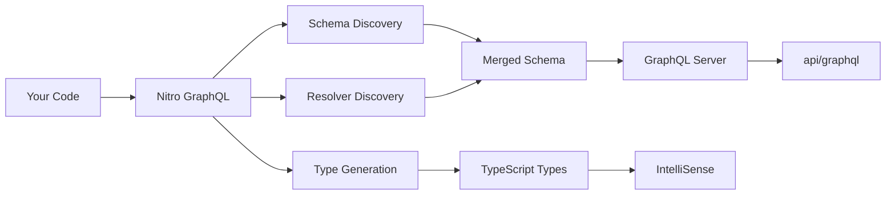

# Introduction

<FunctionInfo fn="introduction"/>

## What is Nitro GraphQL?

**Nitro GraphQL** is a powerful GraphQL integration module for Nitro and Nuxt applications that provides:

- **Auto-discovery** of GraphQL schemas and resolvers
- **Automatic TypeScript type generation** for both server and client
- **Zero-config setup** with sensible defaults
- Support for both **GraphQL Yoga** and **Apollo Server**
- **Apollo Federation** for distributed architectures
- **External GraphQL service** integration

## Why Nitro GraphQL?

Traditional GraphQL setup requires:
- Manual schema stitching and imports
- Boilerplate for server configuration
- Custom build scripts for type generation
- Complex tooling configuration

**Nitro GraphQL eliminates all of this:**

::: code-group

```typescript [Traditional Approach]
// Lots of manual setup...
import { makeExecutableSchema } from '@graphql-tools/schema'
import { createYoga } from 'graphql-yoga'
import { defineEventHandler } from 'h3'

import postResolvers from './resolvers/post'
// Import resolvers manually
import userResolvers from './resolvers/user'

import postSchema from './schemas/post'
// Import schemas manually
import userSchema from './schemas/user'

// Merge everything
const schema = makeExecutableSchema({
  typeDefs: [userSchema, postSchema],
  resolvers: [userResolvers, postResolvers]
})

// Configure server
const yoga = createYoga({ schema })

// Export handler
export default defineEventHandler(yoga)
```

```typescript [Nitro GraphQL Approach]
// nitro.config.ts
import graphql from 'nitro-graphql'
import { defineNitroConfig } from 'nitro/config'

export default defineNitroConfig({
  modules: [
    graphql({
      framework: 'graphql-yoga',
    }),
  ],
})

// That's it! Everything else is automatic.
```

:::

## Key Features

### 🔍 Auto-Discovery

Automatically scans your project and discovers:
- GraphQL schema files (`*.graphql`)
- Resolver files (`*.resolver.ts`)
- Custom directives
- Client queries and mutations

```
server/graphql/
  ├── schema.graphql          # ← Auto-discovered
  ├── users/
  │   ├── user.graphql        # ← Auto-discovered
  │   └── user.resolver.ts    # ← Auto-discovered
  └── posts/
      ├── post.graphql        # ← Auto-discovered
      └── post.resolver.ts    # ← Auto-discovered
```

### 📝 Type Generation

Generate TypeScript types automatically:

```typescript
// Automatically generated types available via virtual imports
import type { Post, Query, User } from '#graphql/server'

export const userQueries = defineQuery({
  // ✅ Fully typed arguments and return values
  user: async (parent, { id }: { id: string }): Promise<User | null> => {
    return await db.user.findUnique({ where: { id } })
  }
})
```

### 🎯 Framework Support

Works with:
- **Nitro** (standalone server)
- **Nuxt 3/4** (full-stack framework)
- Any framework built on Nitro

### 🚀 GraphQL Yoga & Apollo Server

Choose the GraphQL server that fits your needs:

<ComparisonTable :columns="['GraphQL Yoga', 'Apollo Server']" feature-label="Feature">
<tr>
  <td>Bundle Size</td>
  <td class="check">✓ Smaller</td>
  <td>Larger</td>
</tr>
<tr>
  <td>Performance</td>
  <td class="check">✓ Faster</td>
  <td>Fast</td>
</tr>
<tr>
  <td>Federation</td>
  <td>Limited</td>
  <td class="check">✓ Full Support</td>
</tr>
<tr>
  <td>Plugins</td>
  <td class="check">✓ Modern</td>
  <td class="check">✓ Extensive</td>
</tr>
<tr>
  <td>Setup</td>
  <td class="check">✓ Simpler</td>
  <td>More Config</td>
</tr>
</ComparisonTable>

[Compare frameworks in detail →](/guide/framework-comparison)

### 🌐 External Services

Connect to external GraphQL APIs and generate types:

```typescript
// nuxt.config.ts
export default defineNuxtConfig({
  nitro: {
    graphql: {
      externalServices: [
        {
          name: 'github',
          schema: 'https://api.github.com/graphql',
          endpoint: 'https://api.github.com/graphql',
          headers: () => ({
            Authorization: `Bearer ${process.env.GITHUB_TOKEN}`
          })
        }
      ]
    }
  }
})
```

```typescript
// Now use generated types
import type { Repository } from '#graphql/client/github'
```

## How It Works



1. **File Scanning**: Automatically discovers `.graphql` and `.resolver.ts` files
2. **Schema Merging**: Combines all schemas into a unified GraphQL schema
3. **Resolver Loading**: Loads and registers all resolvers
4. **Type Generation**: Generates TypeScript types from your schema
5. **Server Creation**: Sets up GraphQL endpoint at `/api/graphql`
6. **Hot Reload**: Watches for changes during development

## Comparison with Other Solutions

<ComparisonTable :columns="['Nitro GraphQL', 'Apollo Server', 'GraphQL Yoga', 'Mercurius']" feature-label="Feature">
<tr>
  <td>Auto-Discovery</td>
  <td class="check">✓</td>
  <td class="cross">✗</td>
  <td class="cross">✗</td>
  <td class="cross">✗</td>
</tr>
<tr>
  <td>Type Generation</td>
  <td class="check">✓</td>
  <td class="partial">⚠ Manual</td>
  <td class="partial">⚠ Manual</td>
  <td class="partial">⚠ Manual</td>
</tr>
<tr>
  <td>Hot Reload</td>
  <td class="check">✓</td>
  <td class="cross">✗</td>
  <td class="cross">✗</td>
  <td class="cross">✗</td>
</tr>
<tr>
  <td>Nitro Integration</td>
  <td class="check">✓ Native</td>
  <td class="partial">⚠ Manual</td>
  <td class="partial">⚠ Manual</td>
  <td class="check">✓</td>
</tr>
<tr>
  <td>Federation</td>
  <td class="check">✓</td>
  <td class="check">✓</td>
  <td class="partial">⚠ Limited</td>
  <td class="check">✓</td>
</tr>
</ComparisonTable>

## Use Cases

### API Development
Build production-ready GraphQL APIs with minimal setup:
- REST API replacement
- BFF (Backend for Frontend) layer
- Microservices gateway

### Full-Stack Applications
Perfect for Nuxt applications with:
- Server-side GraphQL API
- Type-safe client queries
- Shared types between frontend and backend

### Federation & Microservices
Create distributed GraphQL architectures:
- Multiple subgraphs
- Shared types across services
- Apollo Federation support

### External API Integration
Integrate third-party GraphQL services:
- GitHub API
- Shopify API
- Contentful
- Any GraphQL API

## Next Steps

<div class="next-steps-grid">
<div class="next-step-card">
<h3>📦 Installation</h3>
<p>Install and configure Nitro GraphQL in your project</p>
<a href="/guide/installation">Get Started →</a>
</div>

<div class="next-step-card">
<h3>⚡ Quick Start</h3>
<p>Build your first GraphQL API in 5 minutes</p>
<a href="/guide/quick-start-nitro">Quick Start →</a>
</div>

<div class="next-step-card">
<h3>📖 Core Concepts</h3>
<p>Learn about schemas, resolvers, and types</p>
<a href="/guide/schemas">Learn More →</a>
</div>

<div class="next-step-card">
<h3>💡 Examples</h3>
<p>See real-world implementations</p>
<a href="/examples/nitro-basic">Browse Examples →</a>
</div>
</div>

<style scoped>
.next-steps-grid {
  display: grid;
  grid-template-columns: repeat(2, 1fr);
  gap: 24px;
  margin: 32px 0;
}

.next-step-card {
  padding: 24px;
  border: 1px solid var(--vp-c-divider);
  border-radius: 8px;
  background-color: var(--vp-c-bg-soft);
  transition: all 0.3s;
}

.next-step-card:hover {
  border-color: var(--vp-c-brand-1);
  transform: translateY(-2px);
  box-shadow: 0 8px 16px rgba(225, 0, 152, 0.1);
}

.next-step-card h3 {
  margin-top: 0;
  font-size: 18px;
}

.next-step-card p {
  color: var(--vp-c-text-2);
  font-size: 14px;
}

.next-step-card a {
  color: var(--vp-c-brand-1);
  text-decoration: none;
  font-weight: 600;
}

@media (max-width: 768px) {
  .next-steps-grid {
    grid-template-columns: 1fr;
  }
}
</style>

---

## Source

<SourceLinks fn="introduction"/>

## Contributors

<Contributors fn="introduction"/>

## Changelog

<Changelog fn="introduction"/>
