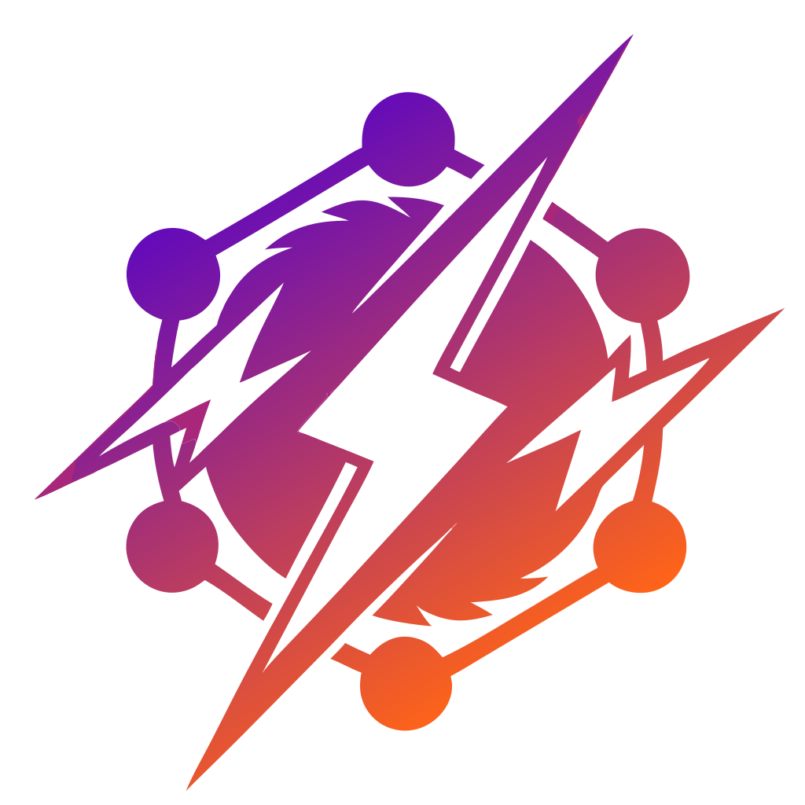

<div align="center">



# Nitro GraphQL

[![npm version][npm-version-src]][npm-version-href]
[![npm downloads][npm-downloads-src]][npm-downloads-href]
[![bundle][bundle-src]][bundle-href]
[![License][license-src]][license-href]
[![Documentation][docs-src]][docs-href]

**The easiest way to add GraphQL to any Nitro application**

🚀 **Auto-discovery** • 📝 **Type Generation** • 🎮 **Apollo Sandbox** • 🔧 **Zero Config**

[📚 Documentation](https://nitro-graphql.pages.dev) • [Quick Start](#-quick-start) • [Examples](#-examples) • [Community](#-community)

</div>

> [!IMPORTANT]
> **v2.0 Beta (Current - Main Branch)**
> This is the **v2.0** beta branch with Nitro v3 and H3 v2 support. Includes Rolldown optimization, improved chunking, and enhanced Vite integration.
>
> **Looking for v1.x?**
> For the stable v1 version (Nitro v2), see the [`v1` branch](https://github.com/productdevbook/nitro-graphql/tree/v1).

---

## 🎥 Watch & Learn

- [**Nuxt 4 Integration**](https://x.com/productdevbook/status/1947314569531076633) - Step-by-step Nuxt setup
- [**Standalone Nitro**](https://x.com/productdevbook/status/1945759751393976348) - Basic Nitro integration

## ✨ Why Nitro GraphQL?

- ⚡ **5-minute setup** - From zero to GraphQL in minutes
- 🔍 **Auto-discovery** - Scans your files, builds your schema
- 📝 **Type-safe** - Full TypeScript support with auto-generated types
- 🎯 **Universal** - Works with Nuxt, Nitro, and any Nitro-based framework
- 🎮 **Developer-friendly** - Built-in Apollo Sandbox for testing
- 🔧 **Zero config** - Sensible defaults, customize when needed

### 🆕 What's New in v2.0 Beta

- 🚀 **Nitro v3 & H3 v2** - Full compatibility with the latest Nitro and H3
- ⚙️ **Rolldown Support** - Optimized for both Rolldown (Vite 7+) and Rollup
- 📦 **Smart Chunking** - GraphQL code split into separate chunks (~98% size reduction)
- 🔍 **Debug Dashboard** - Built-in diagnostics at `/_nitro/graphql/debug` (dev only)
- 🎨 **Enhanced Vite Integration** - Better custom path support and virtual module resolution

## 🚀 Quick Start

### 1. Install

**GraphQL Yoga (recommended):**
```bash
pnpm add nitro-graphql graphql-yoga graphql
```

**Apollo Server:**
```bash
pnpm add nitro-graphql @apollo/server @apollo/utils.withrequired @as-integrations/h3 graphql
```

### 2. Configure

<details>
<summary>🔧 <strong>Nitro Project</strong></summary>

```ts
// nitro.config.ts
import { defineNitroConfig } from 'nitro/config'

export default defineNitroConfig({
  modules: ['nitro-graphql'],
  graphql: {
    framework: 'graphql-yoga', // or 'apollo-server'
  },
})
```

</details>

<details>
<summary>⚡ <strong>Vite + Nitro Project</strong></summary>

```ts
// vite.config.ts
import { defineConfig } from 'vite'
import { nitro } from 'nitro/vite'
import { graphql } from 'nitro-graphql/vite'

export default defineConfig({
  plugins: [
    graphql(), // ⚠️ Must be before nitro()
    nitro(),
  ],
  nitro: {
    modules: ['nitro-graphql'],
    graphql: {
      framework: 'graphql-yoga',
    },
  },
})
```

> **⚠️ Important**: The `graphql()` plugin must be placed **before** `nitro()` to prevent Vite from trying to parse GraphQL files as JavaScript.

</details>

<details>
<summary>🟢 <strong>Nuxt Project</strong></summary>

```ts
// nuxt.config.ts
export default defineNuxtConfig({
  modules: ['nitro-graphql/nuxt'],
  nitro: {
    graphql: {
      framework: 'graphql-yoga',
    },
  },
})
```

</details>

### 3. Create Your Schema

```graphql
# server/graphql/schema.graphql
type Query {
  hello: String!
  greeting(name: String!): String!
}

type Mutation {
  _empty: String
}
```

### 4. Add Resolvers

```ts
// server/graphql/hello.resolver.ts
export const helloResolver = defineResolver({
  Query: {
    hello: () => 'Hello from GraphQL!',
    greeting: (_, { name }) => `Hello, ${name}!`,
  },
})
```

### 5. Start Development

```bash
pnpm dev
```

🎉 **That's it!** Your GraphQL server is ready at:
- **Endpoint**: `http://localhost:3000/api/graphql`
- **Playground**: `http://localhost:3000/api/graphql` (browser)
- **Health**: `http://localhost:3000/api/graphql/health`
- **Debug Dashboard**: `http://localhost:3000/_nitro/graphql/debug` (dev mode only)

## 🎮 Examples

Try these working examples:

| Example | Description | Demo |
|---------|-------------|------|
| [**Nitro Basic**](./playgrounds/nitro/) | Standalone Nitro with GraphQL | `pnpm playground:nitro` |
| [**Vite + Nitro**](./playgrounds/vite/) | Vite with Nitro GraphQL integration | `cd playgrounds/vite && pnpm dev` |
| [**Nuxt Integration**](./playgrounds/nuxt/) | Full Nuxt app with client types | `pnpm playground:nuxt` |
| [**Apollo Federation**](./playgrounds/federation/) | Federated GraphQL services | `pnpm playground:federation` |

## 🏗️ Building Your First Feature

Let's create a complete user management system:

### 1. Define Schema
```graphql
# server/graphql/users/user.graphql
type User {
  id: ID!
  name: String!
  email: String!
  createdAt: DateTime!
}

input CreateUserInput {
  name: String!
  email: String!
}

extend type Query {
  users: [User!]!
  user(id: ID!): User
}

extend type Mutation {
  createUser(input: CreateUserInput!): User!
}
```

### 2. Create Resolvers
```ts
// server/graphql/users/user.resolver.ts
export const userQueries = defineQuery({
  users: async (_, __, { storage }) => {
    return await storage.getItem('users') || []
  },
  user: async (_, { id }, { storage }) => {
    const users = await storage.getItem('users') || []
    return users.find(user => user.id === id)
  }
})

export const userMutations = defineMutation({
  createUser: async (_, { input }, { storage }) => {
    const users = await storage.getItem('users') || []
    const user = {
      id: Date.now().toString(),
      ...input,
      createdAt: new Date()
    }
    users.push(user)
    await storage.setItem('users', users)
    return user
  }
})
```

### 3. Test in Apollo Sandbox
```graphql
mutation {
  createUser(input: {
    name: "John Doe"
    email: "john@example.com"
  }) {
    id
    name
    email
    createdAt
  }
}

query {
  users {
    id
    name
    email
  }
}
```

## 🚀 Advanced Features

<details>
<summary><strong>🎛️ Custom File Generation & Paths</strong></summary>

Control which files are auto-generated and customize their output paths. Perfect for library development, monorepos, or custom project structures.

### Library Mode

Disable all scaffold files for library/module development:

```ts
// nitro.config.ts
export default defineNitroConfig({
  graphql: {
    framework: 'graphql-yoga',
    scaffold: false,        // Disable all scaffold files
    clientUtils: false,     // Disable client utilities
  }
})
```

### Fine-Grained Control

Control each file individually:

```ts
export default defineNitroConfig({
  graphql: {
    framework: 'graphql-yoga',

    // Scaffold files
    scaffold: {
      graphqlConfig: false,     // Don't generate graphql.config.ts
      serverSchema: true,       // Generate server/graphql/schema.ts
      serverConfig: true,       // Generate server/graphql/config.ts
      serverContext: false,     // Don't generate server/graphql/context.ts
    },

    // Client utilities (Nuxt only)
    clientUtils: {
      index: true,              // Generate app/graphql/index.ts
      ofetch: false,            // Don't generate ofetch wrappers
    },

    // SDK files
    sdk: {
      main: true,               // Generate default SDK
      external: true,           // Generate external service SDKs
    },

    // Type files
    types: {
      server: true,             // Generate server types
      client: true,             // Generate client types
      external: true,           // Generate external service types
    }
  }
})
```

### Custom Paths

Customize where files are generated:

```ts
export default defineNitroConfig({
  graphql: {
    framework: 'graphql-yoga',

    // Method 1: Global paths (affects all files)
    paths: {
      serverGraphql: 'src/server/graphql',
      clientGraphql: 'src/client/graphql',
      buildDir: '.build',
      typesDir: '.build/types',
    },

    // Method 2: Specific file paths
    scaffold: {
      serverSchema: 'lib/graphql/schema.ts',
      serverConfig: 'lib/graphql/config.ts',
    },

    sdk: {
      main: 'app/graphql/organization/sdk.ts',
      external: 'app/graphql/{serviceName}/client-sdk.ts',
    },

    types: {
      server: 'types/graphql-server.d.ts',
      client: 'types/graphql-client.d.ts',
    }
  }
})
```

### Path Placeholders

Use placeholders in custom paths:

| Placeholder | Description | Example |
|------------|-------------|---------|
| `{serviceName}` | External service name | `github`, `stripe` |
| `{buildDir}` | Build directory | `.nitro` or `.nuxt` |
| `{rootDir}` | Root directory | `/Users/you/project` |
| `{framework}` | Framework name | `nuxt` or `nitro` |
| `{typesDir}` | Types directory | `.nitro/types` |
| `{serverGraphql}` | Server GraphQL dir | `server/graphql` |
| `{clientGraphql}` | Client GraphQL dir | `app/graphql` |

Example:
```ts
sdk: {
  external: '{clientGraphql}/{serviceName}/sdk.ts'
}
// → app/graphql/github/sdk.ts
// → app/graphql/stripe/sdk.ts
```

### Service-Specific Paths

Customize paths for individual external services:

```ts
export default defineNuxtConfig({
  nitro: {
    graphql: {
      framework: 'graphql-yoga',

      // Global default for all external services
      sdk: {
        external: 'app/graphql/{serviceName}/sdk.ts'
      },

      externalServices: [
        {
          name: 'github',
          endpoint: 'https://api.github.com/graphql',
          schema: 'https://api.github.com/graphql',

          // GitHub-specific paths (override global config)
          paths: {
            sdk: 'app/graphql/organization/github-sdk.ts',
            types: 'types/github.d.ts',
            ofetch: 'app/graphql/organization/github-client.ts'
          }
        },
        {
          name: 'stripe',
          endpoint: 'https://api.stripe.com/graphql',
          schema: 'https://api.stripe.com/graphql',

          // Stripe-specific paths
          paths: {
            sdk: 'app/graphql/payments/stripe-sdk.ts',
            types: 'types/payments/stripe.d.ts',
            // ofetch uses global config
          }
        },
        {
          name: 'shopify',
          endpoint: 'https://api.shopify.com/graphql',
          // No paths → uses global config
          // → app/graphql/shopify/sdk.ts
        }
      ]
    }
  }
})
```

### Path Resolution Priority

When resolving file paths, the system follows this priority order:

1. **Service-specific path** (for external services): `service.paths.sdk`
2. **Category config**: `sdk.external` or `sdk.main`
3. **Global paths**: `paths.clientGraphql`
4. **Framework defaults**: Nuxt vs Nitro defaults

Example:
```ts
// Given this config:
{
  paths: { clientGraphql: 'custom/graphql' },
  sdk: { external: '{clientGraphql}/{serviceName}/sdk.ts' },
  externalServices: [
    {
      name: 'github',
      paths: { sdk: 'app/org/github-sdk.ts' }  // ← Wins (priority 1)
    },
    {
      name: 'stripe',
      // Uses sdk.external (priority 2)
      // → custom/graphql/stripe/sdk.ts
    }
  ]
}
```

### Use Cases

**Monorepo structure:**
```ts
paths: {
  serverGraphql: 'packages/api/src/graphql',
  clientGraphql: 'packages/web/src/graphql',
  typesDir: 'packages/types/src/generated',
}
```

**Multiple external service organizations:**
```ts
externalServices: [
  {
    name: 'github',
    paths: { sdk: 'app/graphql/vcs/github-sdk.ts' }
  },
  {
    name: 'gitlab',
    paths: { sdk: 'app/graphql/vcs/gitlab-sdk.ts' }
  },
  {
    name: 'stripe',
    paths: { sdk: 'app/graphql/billing/stripe-sdk.ts' }
  }
]
```

**Library development (no scaffolding):**
```ts
{
  scaffold: false,
  clientUtils: false,
  sdk: { enabled: true },    // Only generate SDKs
  types: { enabled: true },  // Only generate types
}
```

</details>

<details>
<summary><strong>🎭 Custom Directives</strong></summary>

Create reusable GraphQL directives:

```ts
// server/graphql/directives/auth.directive.ts
export const authDirective = defineDirective({
  name: 'auth',
  locations: ['FIELD_DEFINITION'],
  args: {
    requires: { type: 'String', defaultValue: 'USER' }
  },
  transformer: (schema) => {
    // Add authentication logic
  }
})
```

Use in schema:
```graphql
type Query {
  users: [User!]! @auth(requires: "ADMIN")
  profile: User! @auth
}
```

</details>

<details>
<summary><strong>🌐 External GraphQL Services</strong></summary>

Connect to multiple GraphQL APIs:

```ts
// nuxt.config.ts
export default defineNuxtConfig({
  nitro: {
    graphql: {
      framework: 'graphql-yoga',
      externalServices: [
        {
          name: 'github',
          schema: 'https://api.github.com/graphql',
          endpoint: 'https://api.github.com/graphql',
          headers: () => ({
            Authorization: `Bearer ${process.env.GITHUB_TOKEN}`
          })
        }
      ]
    }
  }
})
```

</details>

<details>
<summary><strong>🔄 Apollo Federation</strong></summary>

Build federated GraphQL services:

```ts
// nitro.config.ts
export default defineNitroConfig({
  graphql: {
    framework: 'apollo-server',
    federation: {
      enabled: true,
      serviceName: 'users-service'
    }
  }
})
```

</details>

## 📖 Documentation

### Core Utilities

All utilities are auto-imported in resolver files:

| Function | Purpose | Example |
|----------|---------|---------|
| `defineResolver` | Complete resolvers | `defineResolver({ Query: {...}, Mutation: {...} })` |
| `defineQuery` | Query-only resolvers | `defineQuery({ users: () => [...] })` |
| `defineMutation` | Mutation-only resolvers | `defineMutation({ createUser: (...) => {...} })` |
| `defineType` | Custom type resolvers | `defineType({ User: { posts: (parent) => [...] } })` |
| `defineDirective` | Custom directives | `defineDirective({ name: 'auth', ... })` |

### Type Generation

Automatic TypeScript types are generated:
- **Server types**: `#graphql/server` - Use in resolvers and server code
- **Client types**: `#graphql/client` - Use in frontend components

```ts
// Server-side
import type { User, CreateUserInput } from '#graphql/server'

// Client-side  
import type { GetUsersQuery, CreateUserMutation } from '#graphql/client'
```

### Project Structure

```
server/
├── graphql/
│   ├── schema.graphql              # Main schema
│   ├── hello.resolver.ts           # Basic resolvers
│   ├── users/
│   │   ├── user.graphql           # User schema
│   │   └── user.resolver.ts       # User resolvers
│   ├── directives/                # Custom directives
│   └── config.ts                  # Optional GraphQL config
```

> **⚠️ Important**: Use **named exports** for all resolvers:
> ```ts
> // ✅ Correct
> export const userQueries = defineQuery({...})
> 
> // ❌ Deprecated
> export default defineQuery({...})
> ```

## 🚨 Troubleshooting

<details>
<summary><strong>Common Issues</strong></summary>

**GraphQL endpoint returns 404**
- ✅ Check `nitro-graphql` is in modules
- ✅ Set `graphql.framework` option
- ✅ Create at least one `.graphql` file

**Types not generating**
- ✅ Restart dev server
- ✅ Check file naming: `*.graphql`, `*.resolver.ts`
- ✅ Verify exports are named exports

**Import errors**
- ✅ Use correct path: `nitro-graphql/utils/define`
- ✅ Use named exports in resolvers

**Vite: "Parse failure: Expected ';', '}' or <eof>" on GraphQL files**
- ✅ Add `graphql()` plugin from `nitro-graphql/vite`
- ✅ Ensure `graphql()` is placed **before** `nitro()` in plugins array
- ✅ Example:
  ```ts
  import { graphql } from 'nitro-graphql/vite'

  export default defineConfig({
    plugins: [
      graphql(), // ← Must be first
      nitro(),
    ]
  })
  ```

**RollupError: "[exportName]" is not exported by "[file].resolver.ts"**

This error occurs when the resolver scanner can't find the expected export in your resolver file. Common causes:

1. **Using default export instead of named export** ❌
   ```ts
   // ❌ WRONG - Will not be detected
   export default defineQuery({
     users: () => [...]
   })
   ```

   ```ts
   // ✅ CORRECT - Use named export
   export const userQueries = defineQuery({
     users: () => [...]
   })
   ```

2. **Not using a define function** ❌
   ```ts
   // ❌ WRONG - Plain object won't be detected
   export const resolvers = {
     Query: {
       users: () => [...]
     }
   }
   ```

   ```ts
   // ✅ CORRECT - Use defineResolver, defineQuery, etc.
   export const userResolver = defineResolver({
     Query: {
       users: () => [...]
     }
   })
   ```

3. **File naming doesn't match export** ❌
   ```ts
   // ❌ File: uploadFile.resolver.ts but export is named differently
   export const fileUploader = defineMutation({...})
   ```

   ```ts
   // ✅ CORRECT - Export name can be anything, as long as it uses a define function
   export const uploadFile = defineMutation({...})
   export const fileUploader = defineMutation({...}) // Both work!
   ```

4. **Syntax errors preventing parsing**
   - Check for TypeScript compilation errors in the file
   - Ensure imports are valid
   - Verify no missing brackets or syntax issues

**How resolver scanning works:**
- The module uses `oxc-parser` to scan `.resolver.ts` files
- It looks for **named exports** using these functions:
  - `defineResolver` - Complete resolver with Query, Mutation, etc.
  - `defineQuery` - Query-only resolvers
  - `defineMutation` - Mutation-only resolvers
  - `defineType` - Custom type resolvers
  - `defineSubscription` - Subscription resolvers
  - `defineDirective` - Directive resolvers
- Only exports using these functions are included in the virtual module

**Debugging steps:**
1. Check your resolver file uses named exports: `export const name = defineQuery({...})`
2. Verify you're using one of the define functions listed above
3. Look for TypeScript/syntax errors in the file
4. Restart the dev server after fixing
5. If issues persist, simplify the resolver to test (single query)

</details>

## 🌟 Production Usage

This package powers production applications:

- [**Nitroping**](https://github.com/productdevbook/nitroping) - Self-hosted push notification service

## 🤖 Using Claude Code

Speed up development with [Claude Code](https://claude.ai/code) — AI-powered assistance for setting up and building with nitro-graphql.

### Quick Setup Prompts

Copy and paste these prompts into Claude Code to scaffold a complete GraphQL API.

**💡 Tip**: After pasting, Claude Code will execute step-by-step and validate each action.

<details>
<summary>🟢 <strong>Nuxt Project</strong></summary>

```
## GOAL
Set up nitro-graphql in this Nuxt project with a User management GraphQL API.

## PREREQUISITES
Check if this is a Nuxt project by looking for nuxt.config.ts in the root.

## STEP 1: INSTALL DEPENDENCIES
Action: Run this command
Command: pnpm add nitro-graphql graphql-yoga graphql
Validation: Check package.json contains these packages

## STEP 2: CONFIGURE NUXT
File: nuxt.config.ts
Action: EDIT (add to existing config, don't replace)
Add these properties:

export default defineNuxtConfig({
  modules: ['nitro-graphql/nuxt'],  // Add this module
  nitro: {
    graphql: {
      framework: 'graphql-yoga',
    },
  },
})

Validation: Check the file has modules array and nitro.graphql config

## STEP 3: CREATE SCHEMA
File: server/graphql/schema.graphql
Action: CREATE NEW FILE (create server/graphql/ directory if needed)
Content:

type User {
  id: ID!
  name: String!
  email: String!
}

type Query {
  users: [User!]!
  user(id: ID!): User
}

type Mutation {
  _empty: String
}

Validation: File should be in server/graphql/ directory

## STEP 4: CREATE CONTEXT (Optional but recommended)
File: server/graphql/context.ts
Action: CREATE NEW FILE (auto-generated on first run, but create manually for clarity)
Content:

// Extend H3 event context with custom properties
declare module 'h3' {
  interface H3EventContext {
    // Add your custom context properties here
    // Example:
    // db?: Database
    // auth?: { userId: string }
  }
}

Note: This file lets you add custom properties to resolver context
Validation: File exists in server/graphql/

## STEP 5: CREATE CONFIG (Optional)
File: server/graphql/config.ts
Action: CREATE NEW FILE (auto-generated, customize if needed)
Content:

// Custom GraphQL Yoga configuration
export default defineGraphQLConfig({
  // Custom context enhancer, plugins, etc.
  // See: https://the-guild.dev/graphql/yoga-server/docs
})

Note: Use this to customize GraphQL Yoga options
Validation: File exists in server/graphql/

## STEP 6: CREATE RESOLVERS
File: server/graphql/users.resolver.ts
Action: CREATE NEW FILE
Content:

// ⚠️ CRITICAL: Use NAMED EXPORTS (not default export)
export const userQueries = defineQuery({
  users: async (_, __, context) => {
    // context is H3EventContext - access event, storage, etc.
    return [
      { id: '1', name: 'John Doe', email: 'john@example.com' },
      { id: '2', name: 'Jane Smith', email: 'jane@example.com' }
    ]
  },
  user: async (_, { id }, context) => {
    // Third parameter is context (H3EventContext)
    const users = [
      { id: '1', name: 'John Doe', email: 'john@example.com' },
      { id: '2', name: 'Jane Smith', email: 'jane@example.com' }
    ]
    return users.find(u => u.id === id) || null
  }
})

Validation: File ends with .resolver.ts and uses named export

## STEP 7: START DEV SERVER
Command: pnpm dev
Expected Output: Server starts on http://localhost:3000
Wait for: "Nitro built in X ms" message
Note: context.ts and config.ts will auto-generate if you skipped steps 4-5

## VALIDATION CHECKLIST
- [ ] Navigate to http://localhost:3000/api/graphql - should show GraphQL playground
- [ ] Health check: http://localhost:3000/api/graphql/health - should return OK
- [ ] Run this query in playground:
  ```graphql
  query {
    users {
      id
      name
      email
    }
  }
  ```
  Expected: Returns 2 users
- [ ] Check .nuxt/types/nitro-graphql-server.d.ts exists (types auto-generated)

## FILE STRUCTURE CREATED
```
server/
  graphql/
    schema.graphql          ← GraphQL type definitions
    context.ts              ← H3 event context augmentation (optional)
    config.ts               ← GraphQL Yoga config (optional)
    users.resolver.ts       ← Query resolvers
.nuxt/
  types/
    nitro-graphql-server.d.ts  ← Auto-generated types
graphql.config.ts           ← Auto-generated (for IDE tooling)
```

## CRITICAL RULES (MUST FOLLOW)
❌ DO NOT use default exports in resolvers
   Wrong: export default defineQuery({...})
   Right: export const userQueries = defineQuery({...})

❌ DO NOT name files without .resolver.ts extension
   Wrong: users.ts or user-resolver.ts
   Right: users.resolver.ts or user.resolver.ts

✅ DO use named exports for all resolvers
✅ DO place files in server/graphql/ directory
✅ DO restart dev server if types don't generate

## TROUBLESHOOTING
Issue: "GraphQL endpoint returns 404"
Fix: Ensure 'nitro-graphql/nuxt' is in modules array (not just 'nitro-graphql')

Issue: "defineQuery is not defined"
Fix: Restart dev server - auto-imports need to regenerate

Issue: "Types not generating"
Fix: Check .nuxt/types/nitro-graphql-server.d.ts exists, if not restart dev server

Issue: "Module not found: nitro-graphql"
Fix: Run pnpm install again, check package.json has the package

## NEXT STEPS (After Setup Works)
1. Add mutations: "Add createUser and deleteUser mutations with H3 storage"
2. Extend context: "Add database connection to context.ts and use it in resolvers"
3. Use types: "Import and use TypeScript types from #graphql/server in resolvers"
4. Add auth: "Add authentication middleware using context in resolvers"
5. Custom config: "Configure GraphQL Yoga plugins in config.ts"

Now implement this setup step-by-step.
```

</details>

<details>
<summary>⚡ <strong>Nitro Project</strong></summary>

```
Set up nitro-graphql in this Nitro project following these exact specifications:

INSTALLATION:
1. Run: pnpm add nitro-graphql graphql-yoga graphql

CONFIGURATION (nitro.config.ts):
import { defineNitroConfig } from 'nitro/config'

export default defineNitroConfig({
  modules: ['nitro-graphql'],
  graphql: {
    framework: 'graphql-yoga',
  },
})

SCHEMA (server/graphql/schema.graphql):
type Product {
  id: ID!
  name: String!
  price: Float!
}

input CreateProductInput {
  name: String!
  price: Float!
}

type Query {
  products: [Product!]!
  product(id: ID!): Product
}

type Mutation {
  createProduct(input: CreateProductInput!): Product!
}

RESOLVERS (server/graphql/products.resolver.ts):
// Use NAMED EXPORTS only
export const productQueries = defineQuery({
  products: async (_, __, context) => {
    // Access H3 event context
    const products = await context.storage?.getItem('products') || []
    return products
  },
  product: async (_, { id }, context) => {
    const products = await context.storage?.getItem('products') || []
    return products.find(p => p.id === id)
  }
})

export const productMutations = defineMutation({
  createProduct: async (_, { input }, context) => {
    const products = await context.storage?.getItem('products') || []
    const product = {
      id: Date.now().toString(),
      ...input
    }
    products.push(product)
    await context.storage?.setItem('products', products)
    return product
  }
})

KEY RULES:
- Files: *.graphql for schemas, *.resolver.ts for resolvers
- MUST use named exports (not default export)
- defineQuery and defineMutation are auto-imported
- Context is the third parameter (access H3 event context)
- Endpoint: http://localhost:3000/api/graphql

Now implement this setup.
```

</details>

<details>
<summary>🎮 <strong>Apollo Server Setup</strong></summary>

```
Set up nitro-graphql with Apollo Server following these exact specifications:

INSTALLATION:
1. Run: pnpm add nitro-graphql @apollo/server @apollo/utils.withrequired @as-integrations/h3 graphql

CONFIGURATION (nitro.config.ts):
import { defineNitroConfig } from 'nitro/config'

export default defineNitroConfig({
  modules: ['nitro-graphql'],
  graphql: {
    framework: 'apollo-server',
  },
})

SCHEMA (server/graphql/schema.graphql):
type Book {
  id: ID!
  title: String!
  author: String!
}

type Query {
  books: [Book!]!
  book(id: ID!): Book
}

type Mutation {
  addBook(title: String!, author: String!): Book!
}

RESOLVERS (server/graphql/books.resolver.ts):
// IMPORTANT: Use NAMED EXPORTS
export const bookResolver = defineResolver({
  Query: {
    books: async () => {
      return [
        { id: '1', title: '1984', author: 'George Orwell' }
      ]
    },
    book: async (_, { id }) => {
      return { id, title: '1984', author: 'George Orwell' }
    }
  },
  Mutation: {
    addBook: async (_, { title, author }) => {
      return {
        id: Date.now().toString(),
        title,
        author
      }
    }
  }
})

KEY RULES:
- framework: 'apollo-server' in config
- defineResolver for complete resolver maps
- Named exports required (export const name = ...)
- Apollo Sandbox: http://localhost:3000/api/graphql
- Supports Apollo Federation with federation: { enabled: true }

Now implement this setup.
```

</details>

<details>
<summary>🔄 <strong>Add Feature to Existing Setup</strong></summary>

```
Add a complete blog posts feature to my nitro-graphql API following these specifications:

SCHEMA (server/graphql/posts/post.graphql):
type Post {
  id: ID!
  title: String!
  content: String!
  authorId: ID!
  createdAt: String!
}

input CreatePostInput {
  title: String!
  content: String!
  authorId: ID!
}

input UpdatePostInput {
  title: String
  content: String
}

extend type Query {
  posts(limit: Int = 10, offset: Int = 0): [Post!]!
  post(id: ID!): Post
}

extend type Mutation {
  createPost(input: CreatePostInput!): Post!
  updatePost(id: ID!, input: UpdatePostInput!): Post
  deletePost(id: ID!): Boolean!
}

RESOLVERS (server/graphql/posts/post.resolver.ts):
// Use NAMED EXPORTS
export const postQueries = defineQuery({
  posts: async (_, { limit, offset }, context) => {
    const posts = await context.storage?.getItem('posts') || []
    return posts.slice(offset, offset + limit)
  },
  post: async (_, { id }, context) => {
    const posts = await context.storage?.getItem('posts') || []
    return posts.find(p => p.id === id) || null
  }
})

export const postMutations = defineMutation({
  createPost: async (_, { input }, context) => {
    const posts = await context.storage?.getItem('posts') || []
    const post = {
      id: Date.now().toString(),
      ...input,
      createdAt: new Date().toISOString()
    }
    posts.push(post)
    await context.storage?.setItem('posts', posts)
    return post
  },
  updatePost: async (_, { id, input }, context) => {
    const posts = await context.storage?.getItem('posts') || []
    const index = posts.findIndex(p => p.id === id)
    if (index === -1) return null
    posts[index] = { ...posts[index], ...input }
    await context.storage?.setItem('posts', posts)
    return posts[index]
  },
  deletePost: async (_, { id }, context) => {
    const posts = await context.storage?.getItem('posts') || []
    const filtered = posts.filter(p => p.id !== id)
    await context.storage?.setItem('posts', filtered)
    return filtered.length < posts.length
  }
})

TYPE USAGE:
After dev server restarts, types are auto-generated in:
- .nitro/types/nitro-graphql-server.d.ts (server types)
- .nuxt/types/nitro-graphql-server.d.ts (for Nuxt)

Import types:
import type { Post, CreatePostInput } from '#graphql/server'

KEY RULES:
- Use "extend type" to add to existing Query/Mutation
- Named exports required
- Context has H3 event properties
- Types auto-generate on file changes

Now implement this feature.
```

</details>

### Working with Your GraphQL API

Once set up, you can ask Claude Code for help with:

```
"Add authentication to my GraphQL resolvers"
"Create a custom @auth directive for field-level permissions"
"Set up type generation for client-side queries"
"Add pagination to my users query"
"Connect to an external GitHub GraphQL API"
"Debug: my types aren't generating in .nitro/types/"
"Optimize resolver performance using DataLoader"
```

### Tips for Better Results

- **Start specific**: Include your framework (Nuxt/Nitro), version, and goal
- **Reference docs**: Mention "following nitro-graphql conventions" to align with best practices
- **Show errors**: Paste error messages for faster debugging
- **Test iteratively**: Run `pnpm dev` after each change to verify

## 🛠️ Development

```bash
# Install dependencies
pnpm install

# Build module
pnpm build

# Watch mode
pnpm dev

# Run playgrounds
pnpm playground:nitro
pnpm playground:nuxt
pnpm playground:federation

# Lint
pnpm lint
```

## 💬 Community

> [!TIP]
> **Want to contribute?** We believe you can play a role in the growth of this project!

### Ways to Contribute
- 💡 **Share ideas** via [GitHub Issues](https://github.com/productdevbook/nitro-graphql/issues)
- 🐛 **Report bugs** with detailed information
- 📖 **Improve docs** - README, examples, guides
- 🔧 **Code contributions** - Bug fixes and features
- 🌟 **Star the project** to show support

### Help Wanted
- [ ] Performance benchmarks
- [ ] Video tutorials
- [ ] Database adapter guides
- [ ] VS Code extension

## Sponsors

<p align="center">
  <a href="https://cdn.jsdelivr.net/gh/productdevbook/static/sponsors.svg">
    
  </a>
</p>

## License

[MIT](./LICENSE) License © 2023 [productdevbook](https://github.com/productdevbook)

<!-- Badges -->
[npm-version-src]: https://img.shields.io/npm/v/nitro-graphql?style=flat&colorA=080f12&colorB=1fa669
[npm-version-href]: https://npmjs.com/package/nitro-graphql
[npm-downloads-src]: https://img.shields.io/npm/dm/nitro-graphql?style=flat&colorA=080f12&colorB=1fa669
[npm-downloads-href]: https://npmjs.com/package/nitro-graphql
[bundle-src]: https://deno.bundlejs.com/badge?q=nitro-graphql@0.0.4
[bundle-href]: https://deno.bundlejs.com/badge?q=nitro-graphql@0.0.4
[license-src]: https://img.shields.io/github/license/productdevbook/nitro-graphql.svg?style=flat&colorA=080f12&colorB=1fa669
[license-href]: https://github.com/productdevbook/nitro-graphql/blob/main/LICENSE
[docs-src]: https://img.shields.io/badge/docs-read-blue?style=flat&colorA=080f12&colorB=1fa669
[docs-href]: https://nitro-graphql.pages.dev